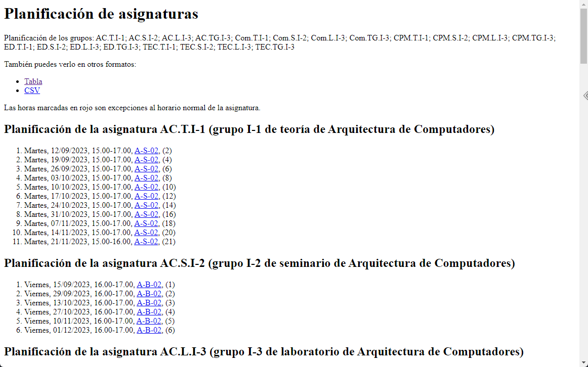

# 📅 EIICAL

> An API wrapper for the EII Schedule webpage which adds additional functionality such as ical format.

## Routes

| Variables           |  Format   |                  Example |
| ------------------- | :-------: | -----------------------: |
| Year                |  `y1-y2`  | `23-24` - Year 2023-2024 |
| Semester            |   `sx`    |    `s1` - First semester |
| University username | `UOxxxxx` |               `UO294054` |

#### MAIN

> eiical.diegomcha.workers.dev/**cal**/**y1-y2**/**sx**/**UOxxxxx**

Redirects the user to the official user page:

#### CSV

> eiical.diegomcha.workers.dev/**cal**/**y1-y2**/**sx**/**UOxxxxx**/**csv**

Downloads the user calendar in CSV format. This file is generated by the official page.

#### ICAL

> eiical.diegomcha.workers.dev/**cal**/**y1-y2**/**sx**/**UOxxxxx**/**ical**

Downloads the user calendar in ICAL format. This file is generated by the from the official CSV. This calendar can be subscribed to.

## Caching

- [**AFFECTS ALL ROUTES!**] **Groups** to which each user belong are cached for **a week**.

- **ICAL** calendar is cached for **12h**.
- The rest of the routes dont implement a cache.
